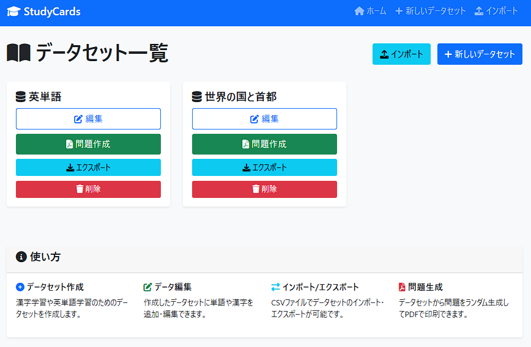
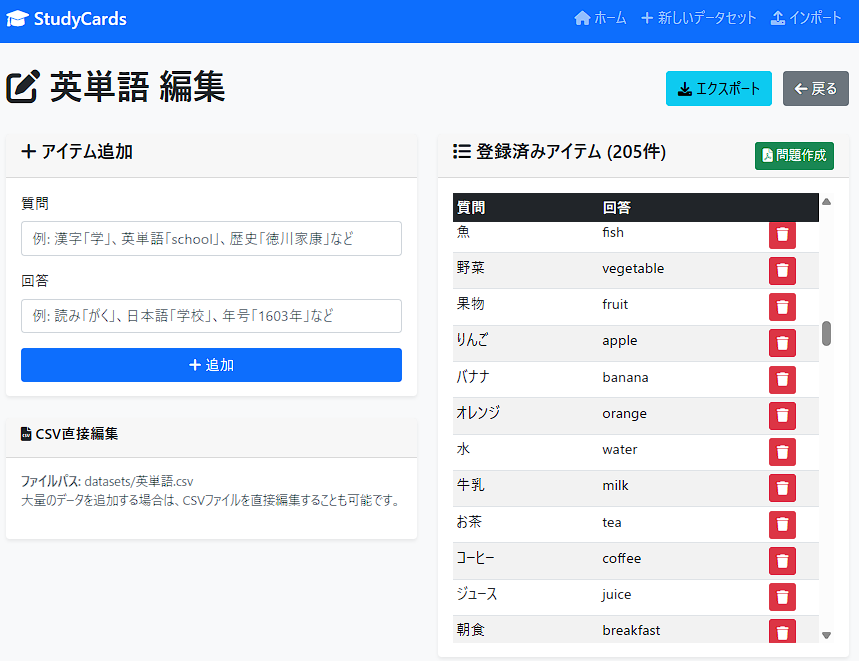

# StudyCards


あらゆる学習内容（漢字、英単語、歴史、理科など）の暗記を支援するWEBアプリケーションです。

## 🌟 主な特徴

- **自動番号付け**: 各問題に自動的に番号が割り当てられ、学習の管理と追跡が簡単
- **シンプルなデータ管理**: 質問と回答のシンプルな学習
- **習熟度管理**: 正解・不正解を記録し、習熟度に基づいた効率的な学習をサポート
- **汎用性**: 漢字、英単語、歴史、理科、数学など、あらゆる暗記学習に対応
- **シンプル**: 統一フォーマット「番号,質問,回答」で管理が簡単（習熟度データは自動管理）
- **オンラインテスト機能**: ブラウザ上でのリアルタイムテスト実行と自己判定
- **印刷対応**: A4サイズの表形式PDFで出力、そのまま印刷して使用可能
- **柔軟な回答出力**: 3つのモード（回答なし/下部表示/赤字表示）から選択可能
- **赤シート対応**: 薄い赤字での回答表示で暗記学習を効率化
- **範囲指定出題**: データセットの特定範囲から問題を生成
- **柔軟な選択方法**: ランダム選択と順番選択の両方に対応
- **コンパクトレイアウト**: 最適化されたPDF生成で用紙を効率的に活用
- **日本語完全対応**: 漢字・ひらがな・カタカナが正しく表示
- **レスポンシブ**: スマートフォンやタブレットでも使用可能

## 📸 スクリーンショット




## 機能

### データセット管理機能
- テーマごとにデータセットを作成
- **自動番号付け**: 各問題に自動的に連番（1, 2, 3...）が割り当てられる
- 統一フォーマット: 番号、質問と回答のシンプルなセット
- 漢字、英単語、歴史年号、理科用語など、どんな内容でも対応
- CSV形式でデータを管理（外部編集可能）
- データのインポート/エクスポート機能
- **習熟度の自動管理**: 正解・不正解の記録と視覚化

### オンラインテスト機能
- **ブラウザ上でのリアルタイムテスト**: 印刷不要でそのままテスト実行
- **自己判定システム**: 回答表示後に正解・不正解を自己判定
- **モバイル最適化**: スマートフォン（iPhone等）での操作に特化したインターフェース
- **リアルタイム進捗表示**: テスト実行中の正解率と問題進捗をリアルタイム表示
- **習熟度の自動更新**: テスト結果から習熟度データを自動的に更新
- **過去の正解率表示**: 各問題の過去の学習履歴を表示
- **柔軟な操作**: スキップ機能、途中終了、戻る機能など充実した操作性
- **キーボードショートカット**: スペースキー（回答表示）、Enter（正解）、Escape（不正解）対応

### 手動結果入力機能
- **印刷テスト結果の管理**: 印刷したテストの結果を手動入力して習熟度を管理
- **習熟度の自動計算**: 正解・不正解の記録から習熟度スコアを自動算出
- **視覚的な習熟度表示**: 色分けされたプログレスバーで学習状況を把握
  - 🟢 緑: 80%以上（習得済み）
  - 🟡 黄: 60-79%（学習中）
  - 🔴 赤: 60%未満（要練習）
- **一括操作機能**: 全問正解・全問不正解・全てクリアのボタンで効率的な入力

### テスト作成機能
- データセットからランダムまたは順番にテストを生成
- デフォルト50問（1～データセット全体まで設定可能）
- **出題対象範囲の指定**: 開始位置と終了位置を指定して特定の範囲から出題
- **選択方法の選択**: ランダム選択または順番選択を選択可能
- **柔軟な回答出力設定**: 3つの出力モードから選択可能
  - 回答なし: 通常のテスト用（問題のみ）
  - 回答を下部に表示: ページ下部に回答一覧を薄い赤字で表示
  - 回答を表示: 回答欄に薄い赤字で表示
- A4サイズでPDF出力（印刷対応、表形式）
- 問題タイプの選択可能
  - 質問→回答（デフォルト）
  - 回答→質問
- 大量問題対応（50問を超える場合は複数ページ自動生成）

### WEBアプリ機能
- 直感的なユーザーインターフェース
- レスポンシブデザイン（モバイル対応）
- フラッシュメッセージでの操作フィードバック
- 日本語フォント完全対応

## 🚀 クイックスタート

### 自動セットアップ（推奨）

**Linux/macOS:**
```bash
git clone https://github.com/tak-s/study-cards.git
cd study-cards
chmod +x setup.sh
./setup.sh
```

**Windows:**
```bash
git clone https://github.com/tak-s/study-cards.git
cd study-cards
setup.bat
```

### 手動セットアップ

1. **リポジトリのクローン**
```bash
git clone https://github.com/tak-s/study-cards.git
cd study-cards
```

2. **仮想環境の作成と有効化**

**Linux/macOS:**
```bash
python -m venv venv
source venv/bin/activate
```

**Windows:**
```bash
python -m venv venv
venv\Scripts\activate
```

3. **依存関係のインストール**
```bash
pip install -r requirements.txt
```

4. **アプリケーションの起動**
```bash
python app.py
```

5. **ブラウザでアクセス**
```
http://localhost:5000
```

## 📚 使い方

### 1. データセットの作成
1. 「新しいデータセット」をクリック
2. データセット名を入力（例：中学1年漢字、英検3級単語、日本史年号など）
3. 「作成」をクリック

### 2. データの追加
1. 作成したデータセットの「編集」をクリック
2. 質問と回答のペアを入力（番号は自動的に割り当てられます）
   - 漢字学習例：質問「大」→ 回答「だい」（番号1として自動登録）
   - 英単語例：質問「school」→ 回答「学校」（番号2として自動登録）
   - 歴史例：質問「関ヶ原の戦い」→ 回答「1600年」（番号3として自動登録）
3. 必要に応じてCSVファイルを直接編集

### 3. 学習方法の選択
1. **オンラインテスト**: 「オンラインテスト」をクリックしてブラウザ上でリアルタイム学習
   - モバイル端末での学習に最適化
   - 自己判定による効率的な学習
   - リアルタイムでの進捗と正解率表示
   - 習熟度データの自動更新
2. **印刷学習**: 「テスト作成」をクリックしてPDF形式で印刷学習
3. **手動結果入力**: 印刷したテストの結果を「結果入力」で手動管理

### 4. テストの生成（印刷用）
1. データセットの「テスト作成」をクリック
2. テスト数を設定（デフォルト50問）
3. **出題対象範囲を設定**（オプション）
   - 開始位置：出題範囲の開始番号を指定（空欄の場合は1番から）
   - 終了位置：出題範囲の終了番号を指定（空欄の場合は最後まで）
4. **問題選択方法を選択**
   - ランダム選択：指定範囲からランダムに問題を選択
   - 順番選択：指定範囲から順番に問題を選択
5. **回答出力設定を選択**
   - 回答なし：通常のテスト用（問題のみ）
   - 回答を下部に表示：ページ下部に回答一覧を薄い赤字で表示
   - 回答を表示：回答欄に薄い赤字で表示（**赤シート対応**で学習効果UP）
6. 問題タイプを選択
   - 質問→回答（デフォルト）
   - 回答→質問
7. 「PDFを生成・ダウンロード」をクリック

### 5. オンラインテストの実行
1. データセットの「オンラインテスト」をクリック
2. テスト設定を選択（問題数、出題範囲、問題タイプ等）
3. テストを開始
4. 各問題で「回答を表示」→ 自己判定（正解/不正解）
5. テスト完了後に結果確認と習熟度データの自動更新

### 6. 習熟度管理（手動入力）
1. データセットの「結果入力」をクリック
2. 印刷したテストの結果を問題ごとに入力
   - 正解: 習熟度スコアが向上
   - 不正解: 試行回数が増加、継続的な学習が必要
3. 一括選択機能で効率的に入力
4. 結果を保存して習熟度データを更新

## 📁 プロジェクト構成

```
study-cards/
├── app.py                      # メインアプリケーション
├── requirements.txt            # 本番用依存関係
├── requirements-dev.txt        # 開発用依存関係（flake8、pip-audit等）
├── README.md                   # このファイル
├── LICENSE                     # MITライセンス
├── SECURITY.md                 # セキュリティガイド
├── CONTRIBUTING.md             # 貢献ガイド
├── SETUP.md                    # 詳細セットアップガイド
├── setup.sh                    # Linux/macOS用セットアップ
├── setup.bat                   # Windows用セットアップ
├── templates/                  # HTMLテンプレート
│   ├── base.html              # ベーステンプレート
│   ├── index.html             # ホームページ
│   ├── create_dataset.html    # データセット作成ページ
│   ├── edit_dataset.html      # データセット編集ページ（番号表示対応）
│   ├── generate_quiz.html     # テスト作成ページ
│   ├── online_test.html       # オンラインテスト実行ページ
│   ├── import_dataset.html    # データインポートページ
│   └── input_results.html     # 手動結果入力ページ（習熟度管理）
└── datasets/                   # データセット保存ディレクトリ
    ├── 英単語.csv             # サンプル英単語データ（番号付き）
    └── 世界の国と首都.csv     # サンプル地理データ（番号付き）
```

## CSV形式について

### 基本フォーマット（推奨）
すべてのデータセットは「番号,質問,回答」の基本フォーマットで管理されます。番号は自動的に割り当てられ、習熟度データも自動的に管理されるため、手動で入力する必要はありません。

```csv
番号,質問,回答
1,大,だい
2,小,しょう
3,学校,がっこう
```

または英語ヘッダー版：
```csv
number,question,answer
1,school,学校
2,teacher,先生
3,apple,りんご
```

### 拡張フォーマット（習熟度データ含む）
エクスポート時や高度な用途では、習熟度データを含む拡張フォーマットが使用されます：

```csv
番号,質問,回答,正解数,総試行回数,習熟度スコア
1,大,だい,8,10,0.8
2,小,しょう,5,8,0.625
3,学校,がっこう,2,3,0.667
```

### インポート時の互換性
- **新フォーマット**: 番号付きCSVファイルはそのまま読み込まれます
- **基本フォーマット**: 番号なしの場合、自動的に番号が追加されます
- **旧形式**: 古いCSVファイルも自動的に新形式に変換されます
- **習熟度データ**: 基本フォーマットでは自動的に初期値（0, 0, 0.0）で追加されます

**重要**: CSVファイルには正解・不正解の情報を手動で入力する必要はありません。クイズ練習機能を使用することで、習熟度データは自動的に記録・更新されます。

### 使用例

**漢字学習データセット:**
```csv
番号,質問,回答
1,大,だい
2,学校,がっこう
3,先生,せんせい
```

**英単語学習データセット:**
```csv
番号,質問,回答
1,school,学校
2,teacher,先生
3,student,学生
```

**使用例**: 基本単語（番号1〜2の範囲）から出題したり、ランダム選択でバランス良く学習できます。

**歴史学習データセット:**
```csv
番号,質問,回答
1,関ヶ原の戦い,1600年
2,江戸幕府開始,1603年
3,明治維新,1868年
```

**使用例**: 範囲指定で「江戸時代」の部分（番号2の問題）から2問出題したり、順番選択で時系列順に問題を生成できます。

**理科学習データセット:**
```csv
番号,質問,回答
1,水の化学式,H2O
2,酸素の化学記号,O
3,炭素の化学記号,C
```

## 特徴

- **自動番号付け**: 各問題に自動的に番号が割り当てられ、問題の管理と識別が簡単
- **汎用性**: 漢字、英単語、歴史、理科、数学など、あらゆる暗記学習に対応
- **統一フォーマット**: シンプルな「番号,質問,回答」形式で管理が簡単
- **習熟度の自動管理**: オンラインテスト実行と手動テスト結果入力により学習進捗を自動追跡
- **オンラインテスト機能**: ブラウザ上でのリアルタイムテスト実行と自己判定システム
- **手軽なデータ管理**: CSV形式なのでExcelやテキストエディタで編集可能
- **印刷対応**: A4サイズの表形式PDFで出力、そのまま印刷して使用可能
- **柔軟な回答出力**: 3つのモード（回答なし/下部表示/赤字表示）から選択可能
- **赤シート学習対応**: 薄い赤字での回答表示で効率的な暗記学習
- **範囲指定出題**: データセットの特定範囲から問題を生成可能
- **柔軟な選択方法**: ランダム選択と順番選択の両方に対応
- **最適化されたレイアウト**: コンパクトなPDF生成で用紙を効率的に活用
- **大量問題対応**: 50問を超える場合は自動で複数ページに分割
- **柔軟な問題設定**: 問題数や出題方向を自由に設定
- **日本語完全対応**: 漢字・ひらがな・カタカナが正しく表示
- **レスポンシブデザイン**: スマートフォンやタブレットでも使用可能
- **データインポート/エクスポート**: 既存データの再利用が簡単
- **後方互換性**: 古いCSVファイルも自動的に新形式に対応

### PDF生成時に日本語が表示されない場合
システムに日本語フォントがインストールされていない可能性があります。以下のパッケージをインストールしてください：

**Ubuntu/Debian:**
```bash
sudo apt-get install fonts-dejavu-core
```

**CentOS/RHEL:**
```bash
sudo yum install dejavu-sans-fonts
```

### ポート5000が使用中の場合
app.pyの最後の行を編集してポート番号を変更してください：
```python
app.run(debug=True, host='0.0.0.0', port=5001)  # ポート番号を変更
```

## 🔒 セキュリティ

本番環境で使用する場合は、[SECURITY.md](SECURITY.md) を必ずお読みください。

## 🤝 貢献

プロジェクトへの貢献を歓迎します！詳細は [CONTRIBUTING.md](CONTRIBUTING.md) をご覧ください。

## 📄 ライセンス

このプロジェクトは[MITライセンス](LICENSE)の下で公開されています。

## 🆘 サポート・質問

- バグ報告: [Issues](https://github.com/tak-s/study-cards/issues)
- 機能要求: [Issues](https://github.com/tak-s/study-cards/issues)
- 質問: [Discussions](https://github.com/tak-s/study-cards/discussions)

## ⚠️ 注意事項

- datasets内のサンプルデータは学習目的で用意したものではありません。実際に使用する際は、適切なデータセットを用意してください。
- 本番環境で使用する際は適切なセキュリティ設定を行ってください
- 大量のデータを扱う場合はサーバーのリソースにご注意ください
